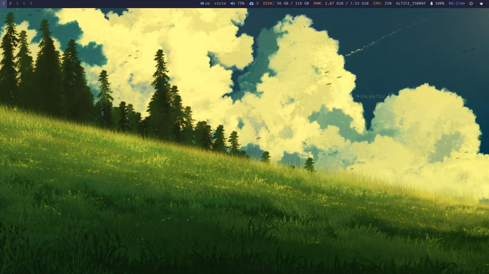
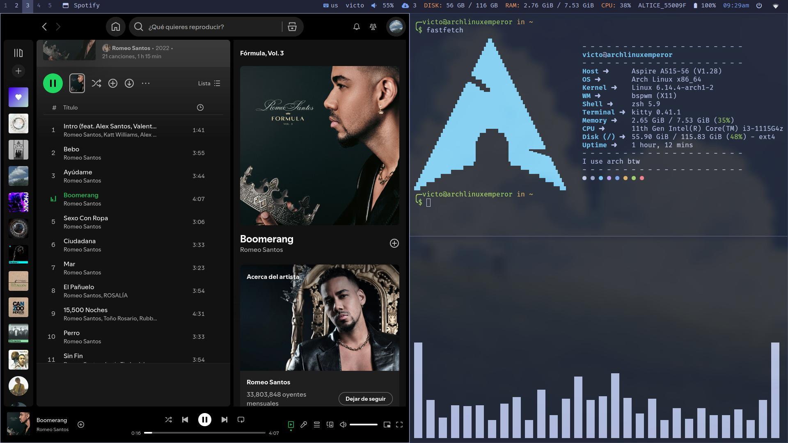
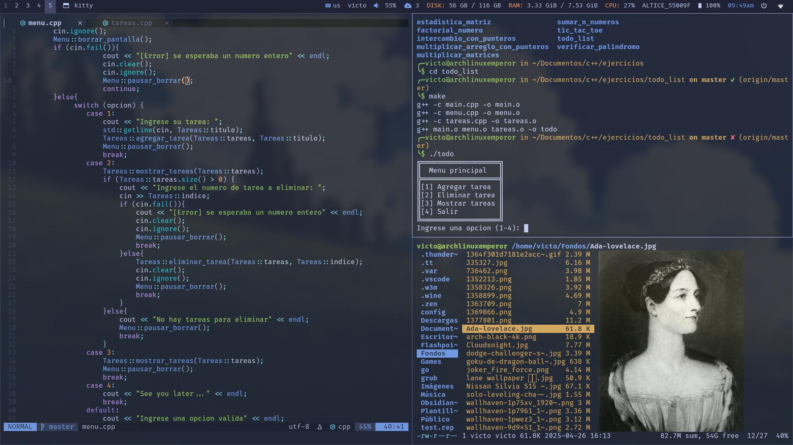
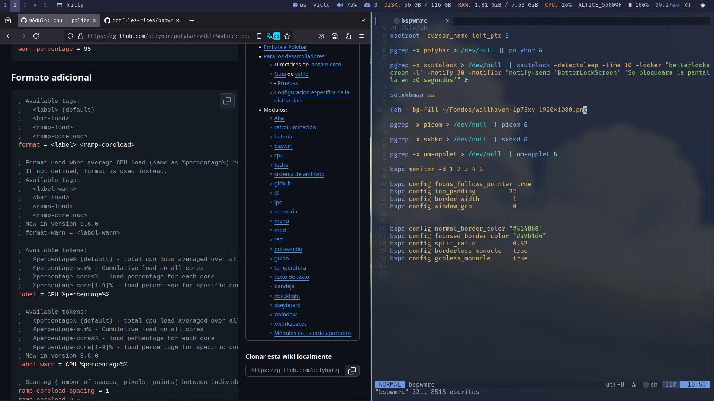
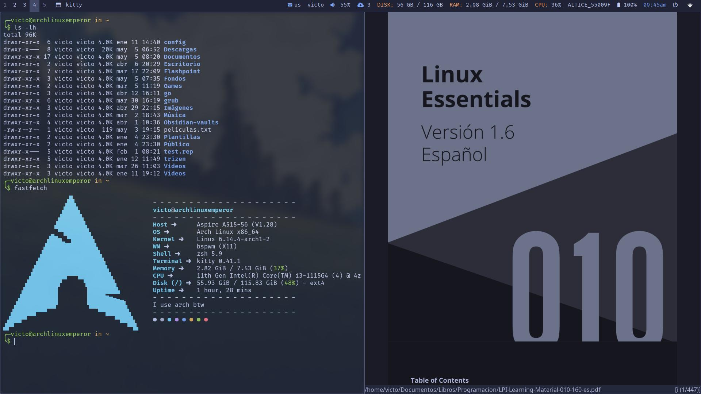

# Rices

## bspwm-tokyo

Um rice de bspwm enfocado en ser minimalista y basado en el tema de tokyonight.

---

### Dependencias

- feh
- sxhkd  
- betterlockscreen (opcional) 
- xautolock (opcional)
- nm-applet (opcional)
- xsettingsd
- dunst
- xorg-server
- xorg-xsetroot

### Info

- **WM:** bspwm
- **Compositor:** picom
- **Terminal:** kitty
- **Visor pdf:** zathura
- **Editor de codigo:** neovim
- **Barra de estado:** polybar
- **Informacion del computador:** fastfetch
- **Menu:** rofi
- **Shell:** zsh + ohmyzsh -> theme = "strug"
- **Gtk-theme:** tokyonight-dark-storm
- **Gestores de archivos:** Thunar (grafico), ranger (terminal)

---

### Capturas











---

### Como usar

Clona el repositorio e ingresa a la carpeta


```
git clone https://github.com/Viccaesar99/dotfiles-rices.github
cd dotfiles-rices
```

Ve a la carpeta del rice de tu eleccion (por ahora solo `bspwm-tokyo`) y ingresa al archivo oculto `.config`, alli encontraras las carpetas que debes copiar y pegar en tu directorio config: `~/.config/`, asegurate de hacer un reespaldo de tus archivos si es necesario.
